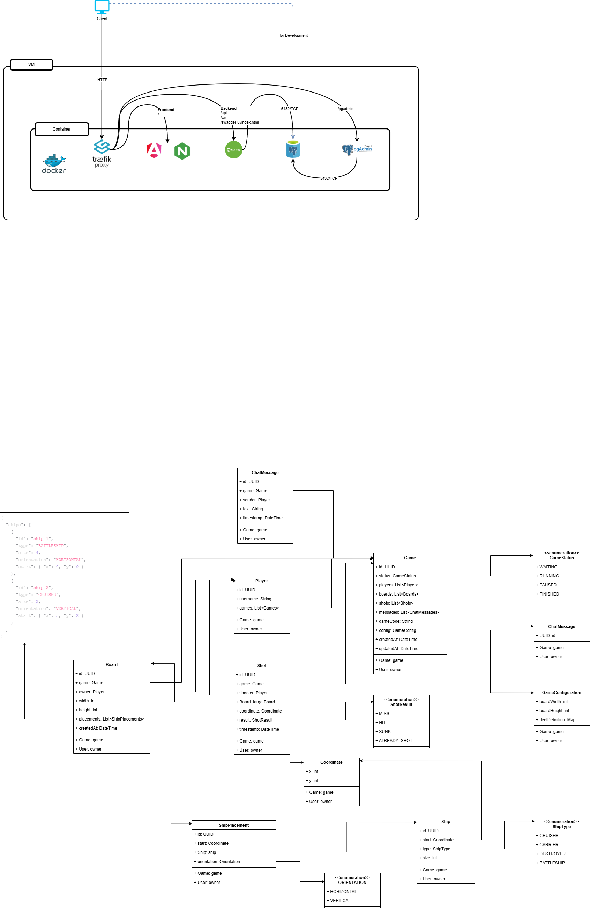

# Battleship Game (CAS OOP 25-20)

A **real-time multiplayer Battleship game** with advanced features including automatic disconnect detection, chat functionality, and token-based resume capability. Developed as part of the **CAS Object-Oriented Programming (CAS OOP 25-20)**.

The project demonstrates **clean object-oriented design**, **production-ready architecture**, and **robust real-time communication**.

## Table of Contents

- [🎯 Overview](#-overview)
    - [Backend Features](#backend-features)
    - [Frontend Features](#frontend-features)
- [🚀 Quick Start](#-quick-start)
    - [Prerequisites](#prerequisites)
    - [Run the Application](#run-the-application)
    - [Access & Management](#access--management)
    - [Development & Reset](#development--reset)
- [🏗️ Architecture](#️-architecture)
    - [Domain Layer](#domain-layer)
    - [Service Layer](#service-layer)
    - [Web / API Layer](#web--api-layer)
    - [Persistence Layer](#persistence-layer)
- [📊 Domain Model](#-domain-model)
    - [Core Entities](#core-entities)
    - [Domain Model Diagram](#domain-model-diagram)
- [🎮 Game Flow](#-game-flow)
    - [Standard Game Flow](#standard-game-flow)
    - [Disconnect & Resume Flow](#disconnect--resume-flow)
- [🔌 API Documentation](#-api-documentation)
    - [REST Endpoints](#rest-endpoints)
    - [WebSocket Topics](#websocket-topics)
    - [Benefits](#benefits)
- [🐳 Docker Setup](#-docker-setup)
    - [Architecture Diagram](#architecture-diagram)
- [🔒 Security](#-security)
    - [Anti-Cheat](#anti-cheat)
    - [Data Privacy](#data-privacy)
- [🚀 Technology Stack](#-technology-stack)
- [🎓 Key Achievements](#-key-achievements)
    - [Technical Innovations](#technical-innovations)
- [👥 Authors](#-authors)
- [📝 Project Focus](#-project-focus)

## 🎯 Overview

### Backend Features
- **Game & Lobby Management** - Automatic matchmaking system
- **Turn-Based Game Logic** - Complete Battleship rules implementation
- **REST API** - Comprehensive endpoints for game interaction
- **WebSocket Real-Time Events** - Instant updates for all game actions
- **Automatic Disconnect Detection** - Graceful network failure handling
- **Resume/Reconnect System** - Token-based game continuation
- **In-Game Chat** - Real-time messaging between players
- **Scheduled Cleanup** - Automatic maintenance of stale connections
- **Docker Ready** - Complete containerized deployment

### Frontend Features
- Interactive game board with automatic ship placement
- Real-time opponent board with shot feedback
- Live chat system
- Connection status monitoring
- Game state management with resume capability

## 🚀 Quick Start

Get the game running in less than ~2 minutes!

### Prerequisites
- Docker & Docker Compose installed

### Run the Application

```
# Clone repository
git clone https://github.com/mertbeyaz/CAS_OOP_Battleship
cd CAS_OOP_Battleship

# Start application (builds images & starts containers)
docker compose -f docker-compose.dev.yml up -d --build
```

### Access & Management
Replace `<ip_address>` with `localhost` or your VM's IP.

| Service | URL | Description                                  |
|---------|-----|----------------------------------------------|
| **Game Frontend** | `http://<ip_address>` | Main Game UI                                 |
| **API Swagger** | `http://<ip_address>/swagger-ui/index.html` | Backend API Documentation                    |
| **Traefik Dashboard** | `http://<ip_address>:8081` | Proxy & Container Status                     |
| **PgAdmin** | `http://<ip_address>/pgadmin` | Database GUI (Login: Use password from .env) |

### Development & Reset

**IntelliJ Configurations:**
* **'Battleship TEST':** Runs locally with H2 (In-Memory).
* **'Battleship DEV':** Connects to Docker DB via PostgreSQL.
  ➡️ *Note: Set `DB_HOST=<ip_address>` in your environment variables.*
* **'Battleship DEV-Reset':** Connects to Docker DB and **resets the data** on start.
  ➡️ *Note: Set `DB_HOST=<ip_address>` in your environment variables.*

**Docker Commands:**

```bash
# 🧨 Reset Database (Wipes data & recreates schema)
APP_PROFILE=dev-reset docker compose -f docker-compose.dev.yml up -d backend

# 🧹 Clean Up (Stops containers & removes volumes)
docker compose -f docker-compose.dev.yml down -v --rmi all --remove-orphans
```

## 🏗️ Architecture

The application follows a **layered architecture** with clear separation of concerns:

### Domain Layer
- Core game logic independent of frameworks
- Entities: `Game`, `Board`, `Player`, `Ship`, `Shot`, `PlayerConnection`
- Business rules encapsulated in domain objects
- No framework dependencies

### Service Layer
- Orchestrates domain logic
- Handles game state transitions
- Publishes WebSocket events
- Manages player connections and disconnect detection

### Web / API Layer
- REST Controllers - HTTP endpoints for game actions
- WebSocket Controllers - STOMP-based real-time communication
- DTOs - Controlled data exposure, no internal IDs leaked
- Event Listeners - Automatic connection monitoring

### Persistence Layer
- Spring Data JPA
- Supports H2 (development / testing) and PostgreSQL (development / production)
- Optimized queries with relationship management

## 📊 Domain Model

### Core Entities

**Game**
- Aggregates players, boards, shots, chat messages, and connections
- Lifecycle: `WAITING` → `SETUP` → `RUNNING` → `PAUSED` → `FINISHED`
- Supports pause/resume with token-based authentication

**Board**
- Owned by exactly one player
- Contains automatic ship placements with validation
- Locked after confirmation

**Ship & ShipPlacement**
- Ship types: Destroyer (2), Cruiser (3), Battleship (4), Carrier (5)
- Placement validation ensures no overlapping
- Covered coordinates tracked for hit detection

**Shot**
- Immutable record of firing action
- Results: `MISS`, `HIT`, `SUNK`, `ALREADY_SHOT`
- Turn logic: Miss switches turn, Hit keeps turn

**PlayerConnection**
- Tracks WebSocket session state
- Enables automatic disconnect detection
- Persists connection history
- Supports reconnection tracking

**Lobby**
- Automatic player pairing system
- Transitions: `WAITING` → `FULL`

### Domain Model Diagram

![PlantUML model](https://www.plantuml.com/plantuml/svg/bHVPRjfAz1s9VnZnSDCjKKlR5okDQi0DLWaWBurwNwu6UsBcneoHFMuWLV-zPyxOnWO7aaXHVFPjpfAlcQIfp5TnjvFTSx6cALsH8APPPagPyaKkcHqamkMFZBplThgTC_BbgHz5_Av4cI2lHicASl7wX42tGnUPJ6aWjL4oe1cpXEHoItvtEuIyvQ51VDyU8H2aZ4eMcj8W8_Zm-8eXFb-7X_W_IhtMEaaMYorX6yb4s683SY3pZ1YQpqK82R62Xqd8WEP2EaI4w8Yk5EQQ5kP_iJJZYJ18d2YEcc75yWoxYgrcLka_j0fbkEDHmJr484-f1CD8NiTq2tweA7WcB-S8NY5faT0qh2W31Mb2janaXNS1qEWLop8QiOeoN59vet6Q8SZJb0dfvQdGTkoGrCgKiYnVCOVHSDj6Vk12iFI0KakRfZsTk3nZgT15A1DKayO0dnP-uA5SWYGN4k4buz5IrX390xW7iFQYU0Z1FLEkBf8aPhJAUC1Ma8TQ2lbwNcAl6aurI4UU1B1vspL6Ldngdr8ESbXj8CrsKFcGKXN1C4dIa0jeWJtRoH6JGIMqfw6eP2pHcKGw29GF9v7xIG8d8YPrzWrTXOORjMVqj3SIACrt3-CaR9Zwe-VG-LC_YkZW4oHUSi_42UPTfseXb3dY898R7e82wMTg_W3U5b0DA34v8oAFOxg8MUlGqFtwmh2crcqf0AM2DWhq6tX6W5fg9tJa3KADW05Ripb_bEX16wZeNOOvAM9_KRn7ryaF6kUCp1R_W-7iv2xPLR8n7idbvI_Kaw2UgwlVkwbukpSC43dUdmXtCMDonEwuu4K7whoe8ZzU32v8VzD_rzzyVFTXymb-FrUjV0CjmKMfgTuBkwRRzwwemgPcVzlGS29dbiXNBycLNZpW1WD1fbDMUd5hsfuzlLQVhkNvS_NX-DDfWPkRlclXKFzcJsrtR8qEr-uprN_p9vE6S6t6jGkFPuxzxspgcHC5_R0SpnwQauF1fwTMkueRstLHbUrXYFxqk_fhJXpB7FtypntFl8CXZjEvLTl8SZrdzjDorBF8rCNKL-YXuzkkGbReZmezC3rlOhbZUrwYFo6twJXsW_lpyye-O8-SBNCHgUlBZAAKHV2wijCNs5bn7j4u8mwCTQEyMc2ZSGPx1QuAIHwO40MZBfN-xdteaUJydFJUNrp0vxLk-WYRNgb6HAcvsq6mBjFlbUFC8CK5qyvLhXLzo-pplEdf9MSGF6bQoFNbOv3omganAhuYWkRqC8Y-l7H0wCUvlxfZCMmtxLNJZVgUnw2A8w7YVbCPgqB7aqCRSF4c-mSTxdOmgZQ9OWCVSfI9gctZRgSUVQistB7QWM9rwZsNiXYpq9RI_PLfa7G7WK2X_IKYoduX5kmsLUK4UGKBy7MBAmVBpQZ9jxjoIgJR-Gf9WV-C_W80)

## 🎮 Game Flow

### Standard Game Flow
1. Player joins lobby (automatic matchmaking)
2. Game created when lobby is full
3. Players place ships (auto-generate)
4. Both players confirm boards (locked)
5. Game starts (`RUNNING`)
6. Players alternate turns
7. Game ends when all ships sunk or player forfeits

### Disconnect & Resume Flow 
1. Player loses connection (browser closed, network failure)
2. Backend detects disconnect after **2-minute grace period**
3. Game automatically pauses (`PAUSED` status)
4. Both players receive real-time notification
5. Players reconnect and resume using resume tokens
6. Two-player handshake: `PAUSED` → `WAITING` → `RUNNING`

## 🔌 API Documentation

### REST Endpoints

#### Lobby
``` 
POST    /api/lobbies/auto-join  # Create a new lobby and game
```
#### Game Management
```
POST   /api/games                    # Create new game
POST   /api/games/{gameCode}/join    # Join existing game
GET    /api/games/{gameCode}         # Get public game state
GET    /api/games/{gameCode}/state   # Full snapshot for reconnect
```

#### Game Actions
```
POST   /api/games/{gameCode}/shots           # Fire a shot
POST   /api/games/{gameCode}/pause           # Pause game
POST   /api/games/{gameCode}/resume          # Resume with token
POST   /api/games/{gameCode}/forfeit         # Forfeit game
POST   /api/games/{gameCode}/boards/reroll   # Auto-generate board
POST   /api/games/{gameCode}/boards/confirm  # Lock board
```

#### Development Endpoints
```
GET    /api/dev/games/{gameCode}/boards/{boardId}/state  # Get specific board state
GET    /api/dev/games/{gameCode}/boards/{boardId}/ascii  # ASCII view
GET    /api/dev/games/{gameCode}/connections             # Connection status
```

### Connection Cleanup (Dev only)
```
GET       /api/dev/cleanup/connections    # Gets a list of all current connections with details
POST      /api/dev/cleanup/connections    # Manually triggers the connection cleanup process
GET       /api/dev/cleanup/status         # Gets the status of connections eglible for cleanup
GET       /api/dev/cleanup/config         # Gets the current cleanup configuration
DELETE    /api/dev/cleanup/all            # Deletes all plaxer connections from the database
```

### WebSocket Topics

```
/topic/games/{gameCode}/events    # Game events
/topic/games/{gameCode}/chat      # Chat messages
/topic/lobbies/{lobbyCode}/events # Lobby events
```
> **Note:** The `/topic/games/{gameCode}/events` topic serves dual purpose:
> - Game state updates (shots, turns, pause/resume)
> - Connection monitoring (disconnect/reconnect notifications)
>
> Frontend subscribes with `playerId` header for automatic connection tracking.

**Event Types:**
- `BOARD_CONFIRMED` / `BOARD_REROLLED`
- `GAME_STARTED` / `GAME_FINISHED` / `GAME_FORFEITED`
- `SHOT_FIRED` / `TURN_CHANGED`
- `GAME_PAUSED` / `GAME_RESUMED` / `GAME_RESUME_PENDING`
- `PLAYER_DISCONNECTED` / `PLAYER_RECONNECTED`

### Benefits
- ✅ Short network issues (< 2min) handled transparently
- ✅ Real disconnects trigger automatic pause
- ✅ Both players notified in real-time
- ✅ Resume via secure token system

## 🐳 Docker Setup

### Architecture Diagram




## 🔒 Security

### Anti-Cheat
- ✅ Opponent board hidden until game end
- ✅ Shot validation server-side
- ✅ Turn validation prevents cheating

### Data Privacy
- ✅ No player IDs in WebSocket events
- ✅ Only usernames in public DTOs
- ✅ Resume tokens validated server-side
- ✅ Dev endpoints profile-protected

## 🚀 Technology Stack

**Backend**
- Java 25, Spring Boot 3.5.8
- Spring Data JPA, Spring WebSocket (STOMP)
- PostgreSQL / H2
- JUnit 5, Mockito, AssertJ

**Frontend**
- Angular 21, TypeScript
- RxJS, STOMP.js
- HTTP Client

**DevOps**
- Docker, Docker Compose
- Traefik, Maven

## 🎓 Key Achievements

1. **Production-Grade Architecture** - Clean, maintainable, scalable
2. **Advanced WebSocket System** - Real-time with disconnect detection
3. **Security-First Design** - No data leaks, anti-cheat
4. **Developer Experience** - Easy setup, Docker-ready

### Technical Innovations
- **Automatic Disconnect Detection** - No frontend polling
- **Graceful Connection Handling** - 2-minute grace period
- **Token-Based Resume** - Secure game continuation
- **Scheduled Cleanup** - Automatic maintenance
- **Multi-Layer Timeout** - Robust failure handling

## 👥 Authors

- **Mert Beyaz** (Frontend) - Angular application, UI/UX, real-time integration
- **Michael Coppola** (Backend) - Architecture, WebSocket system, disconnect detection
> **Transparency Note:** AI tools were used to accelerate coding assistance and debugging.

## 📝 Project Focus

**CAS Learning Objectives:**
- ✅ Object-oriented design & SOLID principles
- ✅ Clean architecture & separation of concerns
- ✅ Composition over inheritance (only one inheritance)
- ✅ Real-time communication & event-driven design
- ✅ State management & error handling
- ✅ Testing strategies & production readiness
- ✅ Docker deployment & DevOps practices


*Developed as part of CAS Object-Oriented Programming (CAS OOP 25-20)*  
*January 2026*
